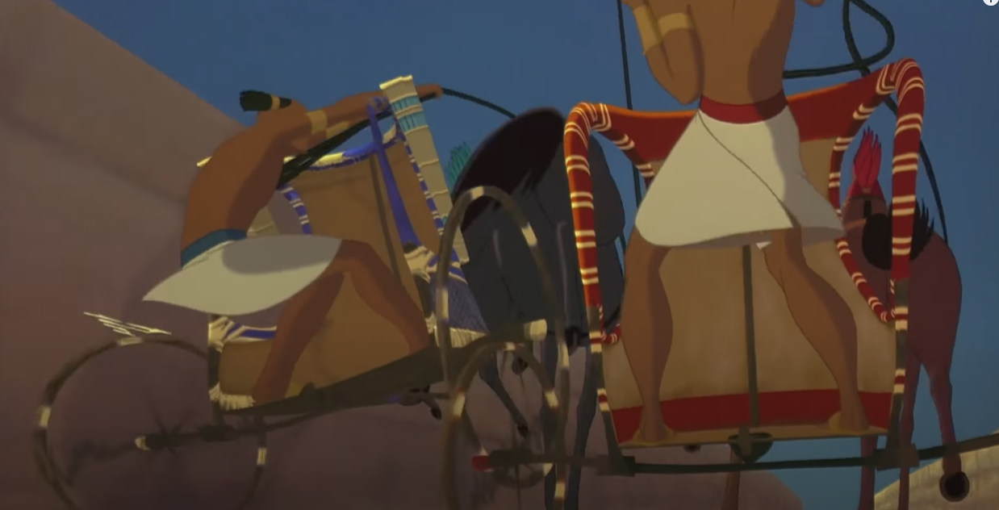

# 2D-coop-game
 A 2D multiplayer game

- Link:
    - https://www.kenney.nl/

---

# Project Alpha
- genre - online multiplayer shooter
- features - you can shoot
	- shoot: latency
	- crouch: 
- client-server

---

# Chariot Race

- genre - racing game in style of temple run but based on the "chariot race" scene from Prince of Egypt 
- features 
	- shifting
	- bumping players
 	- lose of "wheels" & mini shake affect
  	- elevation phase
- how does it play into p2p or cs
	- players can play against each other with p2p, thus not reliaing on the server to be up and running for them to enjoy their favourite game. Furthermore if they're using p2p they can play without need to connect to a server in some random country 
	- or they can use client server to play with more people and keep score of their placement history. server client will be ideal for them if they need to be able to connect to the game from anywhere in the world - in other words if they want to play with each 	other when theyre playing over distance. 
- interface
- Overview:
	- Players can either setup local (p2p) servers to race with each other, or they can connect to a client server. If they decide to connect to a client server they will be able to save their race (placements) and see who is better amongst them. The game is going to be played from top-on-bottom persepective to allow users to see their chariot and their opponent/s as well as when you're close to each other (meaning you can bump each other). Furthermore players can "shift" meaning that if there is sharp 180 degree turn, they can use SHIFT to turn 180 degrees without falling of or without losing the track of the course; at some point of the race there will a "spiral" during which players make multiple sharp turns within short space of time and if they lose track of course they will bump into the "wooden fence" causing the whole structure of "spiral" to shake and there will be "particles" of sand falling down. In addition there will be an elevation phase during which player that is elevated can knock over vases and force the player at the bottom into "object aveitaion"; if during this phase of the game, the bottom player cant avoid object falling on him then he looses a "wheel" (and during that momet his screen shakes) meaning that even if he/she tries to drive straight they will be a shifting a bit to the right or to the left.   

