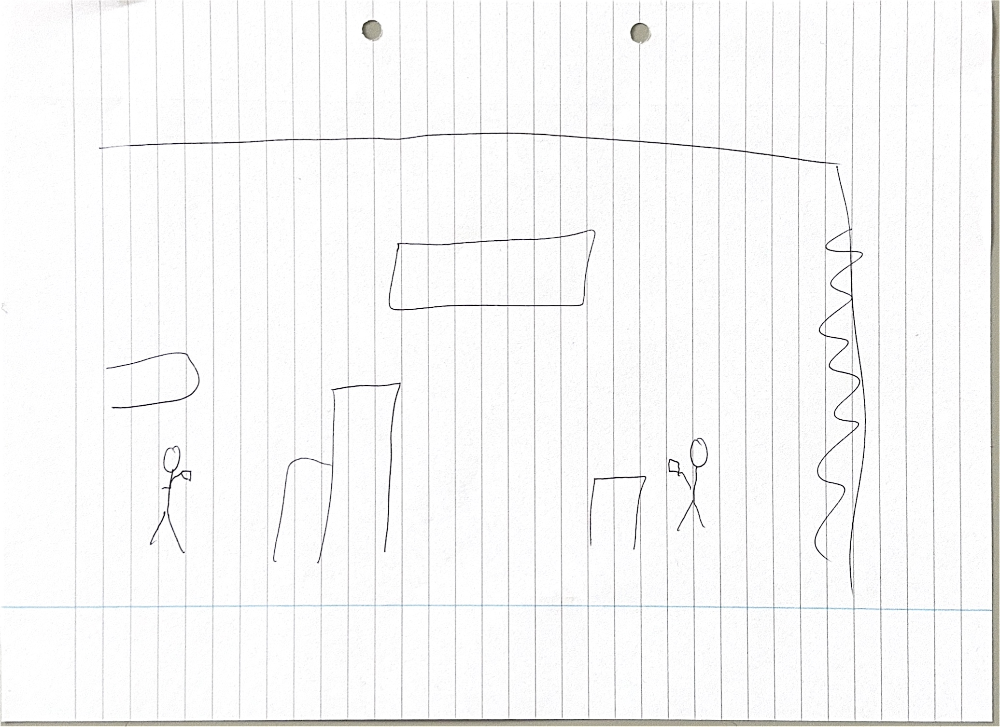
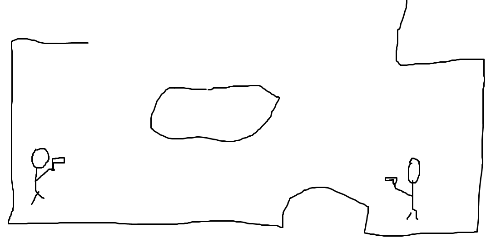
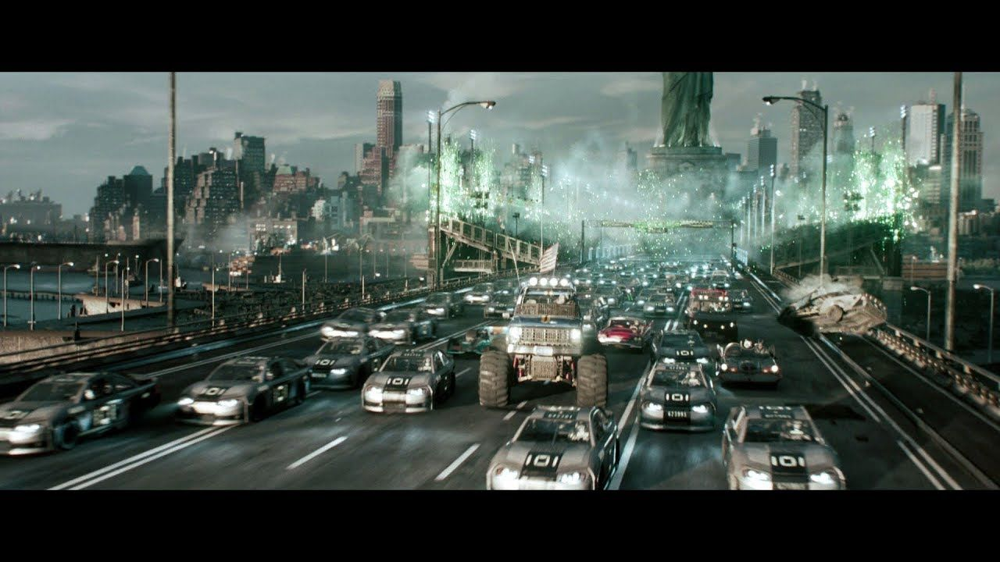

# 2D-coop-game
 A 2D multiplayer game

- Link:
    - https://www.kenney.nl/

---

# Counter- Player：Source（1.0）

- genre - online multiplayer third-person shooter
- features
	- crouch & jump: players can crouch and jump in order to avoid being hit by bullets
 	- Su-Pa: an ability ult that can be unlocked after collecting the points; used to reflect enemy bullets
- Overview:
	- A 2D multiplayer platformer shooter game, in 2D side view. Using client-server, the client has the option to choose what servers to connect to. The server will be accessible from anywhere in the world and anyone can be running their own server by running the 	server python file. 2 or more players - at the moment we are focusing on the 2 player aspect, if we can, we would like the map to change depending on the number of players fighting, for example, 4 players, so a 2v2 combat will have a medium size map and a 3v3 	match would be a much 	larger map - will combat each other using a simple gun which fires in straight line. Each player has 3 lives, when a player is touched by a bullet, he looses 1 life. If the players has been shot 3 times, the player dies. The player can 	jump, go forwards, backwards and crouch (crouch can be used to avoid bullets' impact). Everytime a player dodges successfully a bullet, he gains a "Su-Pa" token, at 5 "Su-Pa" tokens, the player can use "mirror shield" to deflect opponents' bullet thus mirroring 	it pathway.

- analysis:
	- server/client
		- what should be trusted from the client ?
			- possible source code

---

# Mad Horizon : Rise of the Nova (No Objectives, Variables Anknown)
 
- genre - racing game in style of Ready Player One race scene
- features 
	- pop up spike-block: when you're driving there is a pop up spike-block player takes 1/2 unit of the players damage
	- nitro road: part of the racing track where player will be sped up; there is a chance they will bump into the player at the front (if there is one) or they will just meet another obsticle in front of them
  	- speeding ticket: if the player drives over this part of the road they will be slowed down causing the player/s behind them to bump into them.
  	- change of settings: when players drive through different parts of the city (e.g. Beach, China Town, Aquarium)
  	- 
- how does it play into p2p or cs
	- players can play against each other with p2p, thus not reliaing on the server to be up and running for them to enjoy their favourite game. Furthermore if they're using p2p they can play without need to connect to a server in some random country 
	- or they can use client server to play with more people and keep score of their placement history. server client will be ideal for them if they need to be able to connect to the game from anywhere in the world - in other words if they want to play with each 	other when theyre playing over distance. 

## interface

- Overview:
	- Players will be preented with a Ready Player One style race, where they will have to race each other while avoiding in game obsitcles. The goal of the game - like any other racing game - will be to come first but there is caviat, the game doesnt only rely on players skill to drive but also to navigate to surrounding environment and adapt to new things. Players will be able to collide with each other (to make it interactive) while also having to dodge the obsticles on the road, this should introduce rational competitevness to the point where they can race on their own while still being forced to interact with other players' cars.   

